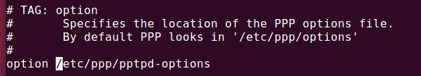
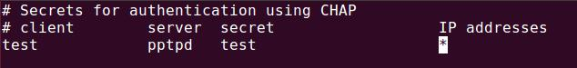
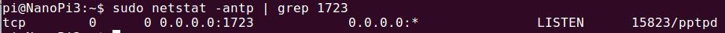

Linux 搭建 vpn 服务（pptpd协议）
===

参考博客：  
[Jarett's Blog](https://www.nigesb.com/setup-your-own-vpn-with-pptp.html)

## 目录
[安装pptpd](#安装pptpd)  
[配置IP地址](#配置ip地址)  
[配置客户端DNS](#配置客户端DNS)  

## 安装pptpd
#### Ubuntu 系统：
```bash
sudo apt-get install pptpd
```
#### CentOS 系统：
```bash
sudo yum -y install pptpd
```
>如果是 root 用户，则可以去掉 sudo 不写。

## 配置IP地址

编辑 /etc/pptpd.conf 文件，在文件最后加入 IP 地址配置：  
```
localip 10.0.0.1  
remoteip 10.0.0.100-200  
```
>上面的IP地址是可以随便填的，ABC三类的内网地址都可以，主要兼顾其他地方的IP配置，不要出现IP冲突就可以了。后面的 remoteip 是分配给用户的IP，默认从第一个 10.0.0.100 开始分配，localip 表示分配给服务器的内部网关地址。

## 配置客户端DNS
首先确认配置文件。默认是 /etc/ppp/pptpd-options。查看 /etc/pptpd.conf 中指定的 option 文件。我的如下：  

从图中可以看出，就是在默认的位置。在配置文件中加上：
```
ms-dns 8.8.8.8  
ms-dns 114.114.114.114  
```
>如果示例中的DNS地址不行，那么换成客户端所在地的DNS就好了。

## 配置VPN账号
接下来是创建 VPN 的账号。账户和密码信息保存在文件 `/etc/ppp/chap-secrets` 中。如下图所示：

总共有四个字段，依次为`账号` `协议`  `密码`  `IP地址`。协议显然是 pptpd。IP地址如果填明文，则是自动分配，但是需要在remoteip的范围内，见[配置IP地址](#配置ip地址)。一般是填 `*`，表示自动分配。

## 启动服务
至此，配置完毕。可以启动服务并加入启动项了。  
#### 启动 pptpd 服务
```
sudo service pptpd restart
```
#### 设置开机启动
```
sudo sysv-rc-conf
```
> 如果提示 sysv-rc-conf 命令没有找到，可以使用命令：
`sudo apt-get install sysv-rc-conf`
来安装。有关开机启动的更多内容，可以参考有关Linux书籍的相关章节，或者参考[这篇博客](http://blog.csdn.net/mashangyou/article/details/24505167)。

查看一下服务器是否在 1723 端口上面监听了。查看的命令为：
```bash
sudo netstat -antp | grep 1723
```

看到 `LISTEN`，表示服务器已经在 1723 端口上面监听了，说明服务已成功开启。

## 配置系统转发
首先编辑文件 `/etc/sysctl.conf`,去掉文件中这一行的注释：
```
net.ipv4.ip_forward=1
```
使它立刻生效：
```
sudo sysctl -p
```

>接下来设置转发规则，需要用到 iptables ，如果没有，使用命令 `sudo apt-get install iptables` 安装即可。

#### 配置防火墙转发
```bash
sudo iptables -t nat -A POSTROUTING -s 10.0.0.0/24 -o eth0 -j MASQUERADE
```
#### 配置转发包的 mss
```
sudo iptables -A FORWARD -p tcp --syn -s 10.0.0.0/24 -j TCPMSS --set-mss 1356
```
> __注意__：ech0是网卡的名称。服务器就是通过 eth0 转发流量。Linux下的有线网卡名称一般是eth0，但不是一定的。可以通过命令 `ifconfig` 来查看自己的网卡名称。

## 开机自动载入iptables

#### Ubuntu
```bash
iptables-save > /etc/iptables.rules
cat > /etc/network/if-up.d/iptables<<EOF
#!/bin/sh
iptables-restore < /etc/iptables.rules
EOF
chmod +x /etc/network/if-up.d/iptables
```
#### CentOS
```bash
service iptables save
```
> 需要切换到root用户执行命令。